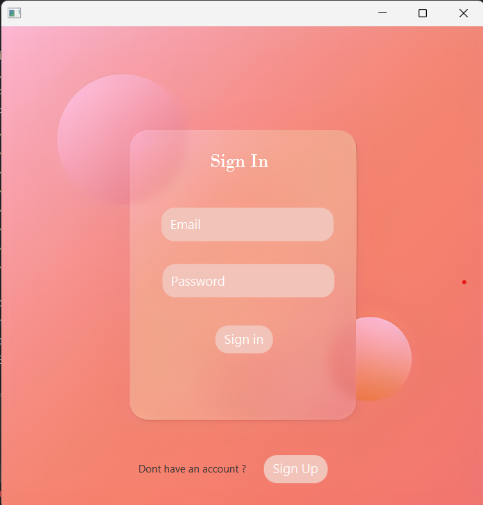
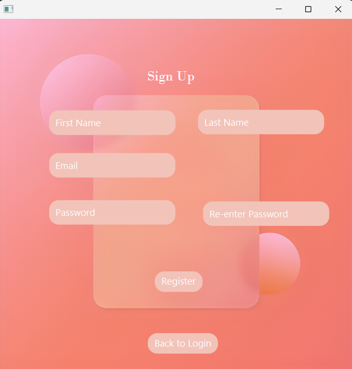
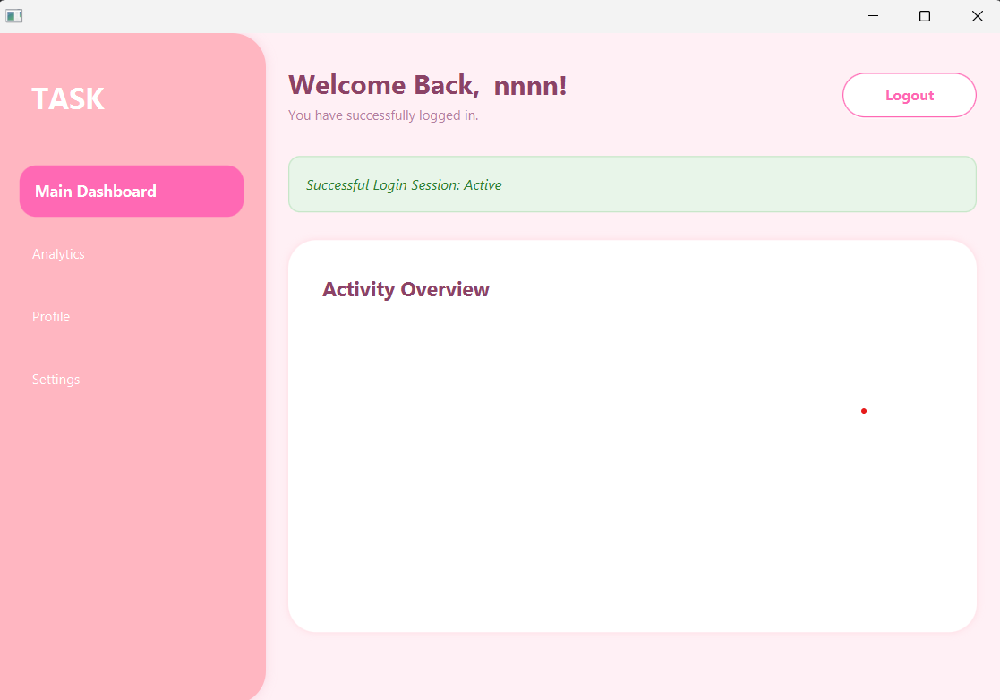

# 🌸 PinkDash: JavaFX Secure Dashboard

A modern, "slightly pink" themed desktop application built with JavaFX. This project features a secure user authentication system using **jBCrypt** for password hashing and **MySQL** for persistent data storage.

## 📸 Screenshots

### Sign In Page


### Sign Up Page


### Dashboard


## ✨ Features

* **Secure Authentication:** Passwords are never stored in plain text. We use `BCrypt` with unique salts.
* **Dynamic Dashboard:** Upon login, the system fetches the user's `first_name` and displays a personalized welcome message.
* **Modern UI:** A soft pink color palette (#FFF0F5) with custom CSS-styled FXML components.
* **Input Validation:** Email format checks (ending in @gmail.com) and strong password requirements (8+ chars, Upper/Lower/Symbols).
* **Session Management:** Functional Logout button that safely returns the user to the Sign-In screen.

## 🛠️ Technologies Used

* **Java:** Version 11 or higher.
* **JavaFX:** For the Graphical User Interface (GUI).
* **MySQL:** Database management system.
* **jBCrypt:** For secure password hashing.
* **Scene Builder:** Used for FXML design.

## 🚀 Getting Started

### 1. Prerequisites
* JDK 11+
* MySQL Server
* Maven or jBCrypt Jar file

### 2. Database Setup
Execute the following SQL command to create the necessary table structure:

```sql
CREATE DATABASE PinkDashDB;
USE PinkDashDB;

CREATE TABLE User (
    id INT AUTO_INCREMENT PRIMARY KEY,
    first_name VARCHAR(50) NOT NULL,
    last_name VARCHAR(50) NOT NULL,
    email VARCHAR(100) UNIQUE NOT NULL,
    password_hash VARCHAR(255) NOT NULL
);
```
### 3. InstallationClone the repository:Bashgit clone [https://github.com/rashmiwijemanna/Task_Fx.git](https://github.com/rashmiwijemanna/Task_Fx.git)
Configure your database credentials in DBConnection.java.Build the project and run AppInitializer.java.

### 4.📂 Project StructurePlaintextsrc/
```
├── controller/
│   ├── SignInFormController.java   # Authentication logic
│   ├── SignUpFormController.java   # Registration & Hashing
│   └── DashBoardFormController.java # User data display
├── db/
│   └── DBConnection.java           # Singleton Database link
├── view/
│   ├── SignIn.fxml                 # Login UI
│   ├── SignUp.fxml                 # Registration UI
│   └── DashBoard.fxml              # Main Dashboard UI
└── AppInitializer.java             # Main Entry Point
```
### 5.🔒 Security LogicThis application follows the Lock and Key principle:
1. **Registration:** User provides a password $\rightarrow$ BCrypt.hashpw() generates a salted hash $\rightarrow$ Hash is saved to DB.
2. **Login:** User enters password $\rightarrow$ BCrypt.checkpw(input, storedHash) verifies the match without decrypting.


